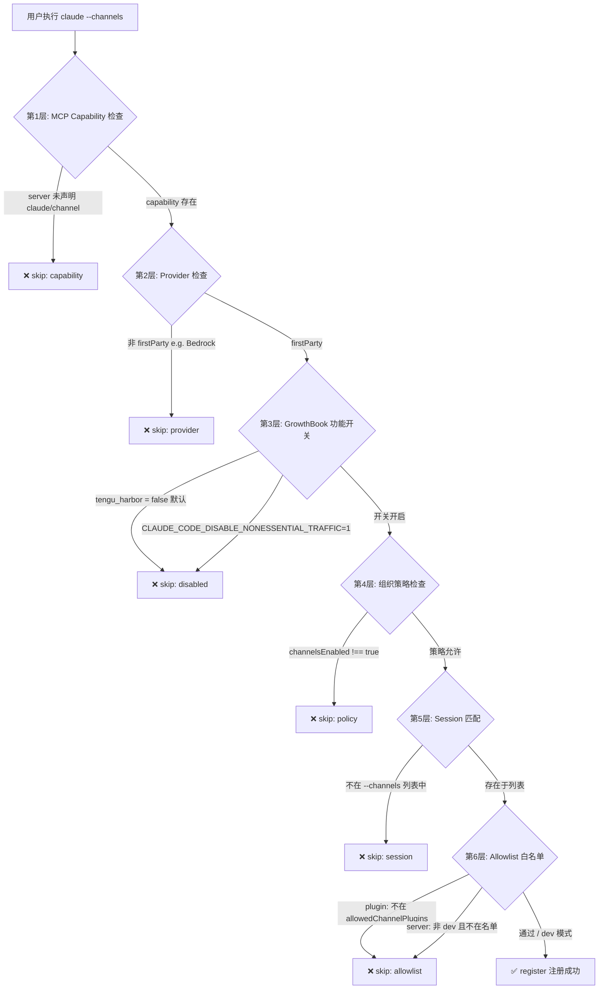
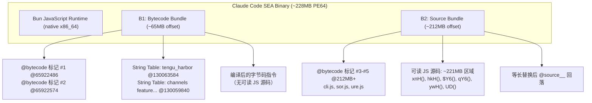
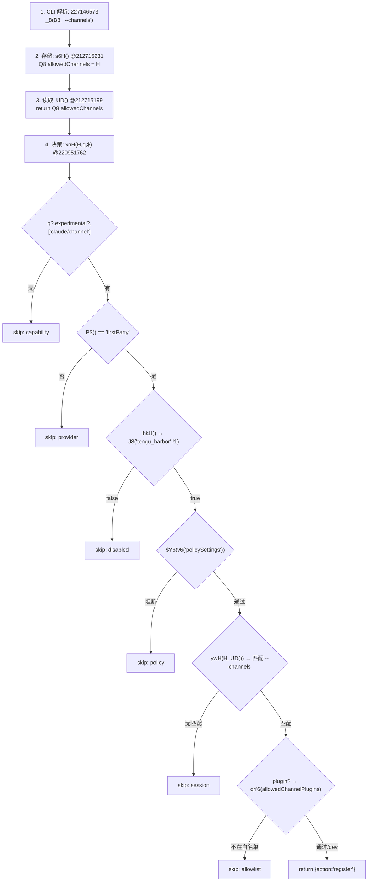
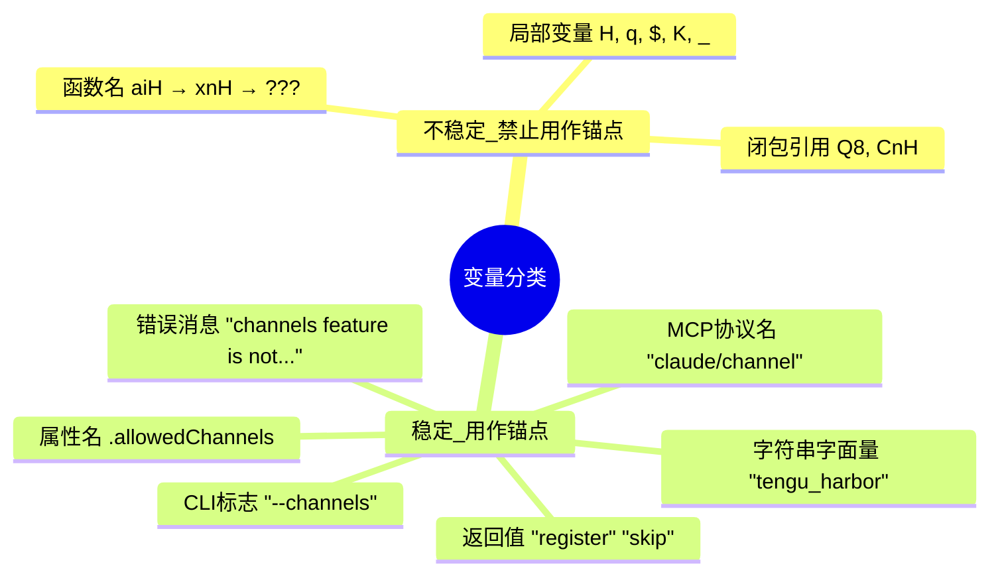
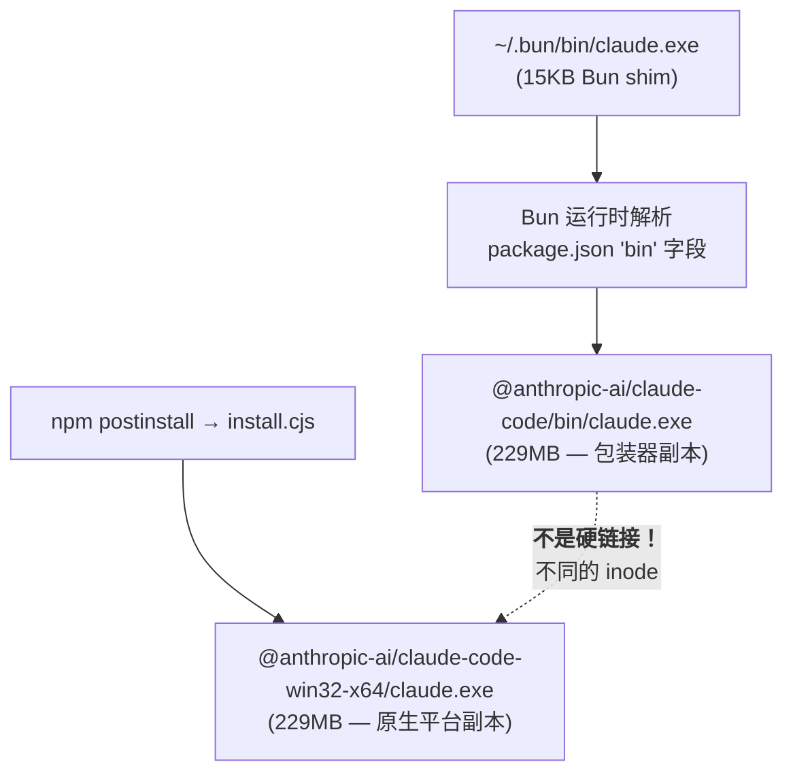
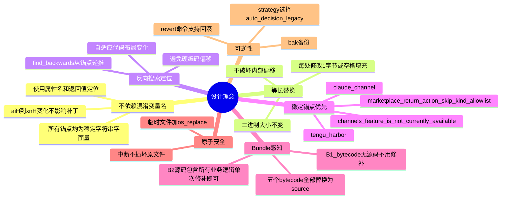

# Claude Code Channel 补丁机制与安装深度分析 v2

> 基于 2026-05-19 对最新 Claude Code 二进制（228MB, win32-x64）的 Python 字节搜索逆向分析。
> 上一版本（v1）：2 份相同 JS bundle → 当前（v2）：Bytecode bundle (B1) + Source bundle (B2)

## 1. Claude Code Channel 体系的限制层次

### 当前限制流程图（v2）



### 限制层次详解（当前版本）

| 层级  | 源码检查                                      | 默认值            | 函数调用                      |
| ----- | --------------------------------------------- | ----------------- | ----------------------------- |
| 第1层 | MCP Capability 声明                            | 服务端要求        | `q?.experimental?.["claude/channel"]` |
| 第2层 | API Provider 类型                              | 仅限 `firstParty` | `P$() == "firstParty"`        |
| 第3层 | GrowthBook 功能开关 (`tengu_harbor`)            | `!1` (false)      | `hkH()` → `J8("tengu_harbor",!1)` |
| 第4层 | 组织策略 (`channelsEnabled`)                     | 未设置            | `$Y6(v6("policySettings"))`   |
| 第5层 | Session `--channels` 列表匹配                   | 空列表            | `ywH(H, UD())`                |
| 第6层 | Allowlist 白名单 (`allowedChannelPlugins`)       | 空列表            | `qY6(K?.allowedChannelPlugins)` |

> **v1 vs v2 关键变化**：显式的 `accessToken` OAuth 检查已从 channel 决定函数中**移除**。
> 新代码不再有 `kind:"auth"` skip 路径。Provider 检查（firstParty vs 第三方）取代了它的位置。

## 2. 二进制结构：Bun SEA 双 Bundle 架构

### 2.1 Bundle 布局（Python bytes.find 定位）



### 2.2 关键地址速查表

通过 `strings` + Python `data.find()` 在 228MB 二进制中定位：

| 元素 | 偏移量 (hex) | 定位方法 |
| ---- | ------------ | -------- |
| B1 @bytecode 标记 #1 | `0x3ED8F96` (65922486) | `data.find(b'// @bun @bytecode @bun-cjs')` |
| B1 @bytecode 标记 #2 | `0x3ED8FBE` (65922574) | `data.find(b'// @bun @bytecode', start)` |
| B1 Feature Message (string table) | `0x7C21CF0` (130063584) | `data.find(b'channels feature is not')` |
| B2 @bytecode 标记 #3 (cli.js) | `0xCADFDF3` (212661616) | 同上，offset > 180MB |
| B2 源码: hkH() (feature gate) | `0xD2B051E` (220950390) | `data.find(b'function hkH(')` |
| B2 源码: xnH() (channel decision) | `0xD2B0A92` (220951762) | `data.find(b'function xnH(')` |
| B2 源码: Feature Message | `0xD2B0BE1` (220952097) | 同上 feature message |
| B2 源码: $Y6() (org policy) | 在 xnH 之前 | `data.find(b'function $Y6(')` |
| B2 源码: qY6() (allowlist) | 在 xnH 之前 | `data.find(b'function qY6(')` |
| B2 源码: UD() (session channels) | `0xCAD860C` (212715196) | `data.find(b'Q8.allowedChannels')` 向后搜索 |
| B2 源码: s6H() (store channels) | `0xCAD862F` (212715231) | 同上 |
| B2 源码: return{action:"register"} | `0xD2B0C3D` (220953309) | `data.find(b'return{action:\"register\"}')` |

### 2.3 定位方法：Python 单行搜索命令

```python
# 基础：读入整个二进制到内存
with open('claude.exe', 'rb') as f:
    data = f.read()

# 查找所有匹配项
def find_all(data, pattern):
    results, start = [], 0
    while (idx := data.find(pattern, start)) != -1:
        results.append(idx)
        start = idx + 1
    return results

# 判断属于哪个 Bundle
def classify(idx):
    return 'B1' if idx < 180_000_000 else 'B2'

# 示例：找所有 tengu_harbor 出现位置
for off in find_all(data, b'tengu_harbor'):
    print(f'{classify(off)} @{off}')
```

## 3. --channels 的完整源码执行流程

### 3.1 流程总览 (Python bytes 搜索追踪)



### 3.2 第一步：CLI 参数解析

**偏移量**: `~227146573` (B2 源码区域)

```javascript
// 简化的反混淆伪码
X8 = _8(B8, "--channels");   // 从 CLI args 提取 --channels 值
s6H(X8);                      // 存储到 session
```

**在二进制中定位**：
```python
# 搜索 "--channels" 字符串在 B2 源码中的位置
for off in find_all(data, b'--channels'):
    if off > 180_000_000:
        ctx = data[off-40:off+80]  # 查看上下文
```

`_8()` 是一个通用的参数解析器（类似 `args.get("--channels")`），返回 `string[]`。

### 3.3 第二步：Session 存储

**偏移量**: `212715231` (B2)

```javascript
// s6H() 和 UD() 在同一个紧凑块中
function UD(){return Q8.allowedChannels}
function s6H(H){Q8.allowedChannels=H}
```

**定位方法**：
```python
# 搜索 Q8.allowedChannels 字符串，向后查找 function 关键字
off = data.find(b'Q8.allowedChannels')
# 在 off 之前搜索 'function ' 找到函数定义
fn_start = data.rfind(b'function ', 0, off)
```

### 3.4 第四步：Channel 决定函数（核心）

**偏移量**: `220951762` (B2)

```javascript
function xnH(H, q, $) {
    // 第1层: MCP 协议层 Capability 检查
    if (!q?.experimental?.["claude/channel"])
        return {action:"skip", kind:"capability",
                reason:"server did not declare claude/channel capability"};

    // 第2层: API Provider 检查（取代了旧的 accessToken OAuth 检查）
    if (P$() != "firstParty")
        return {action:"skip", kind:"provider",
                reason:"channels are not available on third-party providers"};

    // 第3层: GrowthBook 功能开关
    if (!hkH())
        return {action:"skip", kind:"disabled",
                reason:"channels feature is not currently available"};

    // 第4层: 组织策略
    let K = v6("policySettings");
    if ($Y6(K))
        return {action:"skip", kind:"policy",
                reason:"channels not enabled by org policy..."};

    // 第5层: Session --channels 列表匹配
    let _ = ywH(H, UD());
    if (!_)
        return {action:"skip", kind:"session",
                reason:`server ${H} not in --channels list for this session`};

    // 第6层: Allowlist 白名单检查
    if (_.kind == "plugin") {
        let A = $ ? k$($).marketplace : void 0;
        if (A != _.marketplace)
            return {action:"skip", kind:"marketplace", ...};
        if (!_.dev) {
            let {entries: f, source: z} = qY6(K?.allowedChannelPlugins);
            if (!f.some((Y) => Y.plugin === _.name && Y.marketplace === _.marketplace))
                return {action:"skip", kind:"allowlist", ...};
        }
    } else if (!_.dev)
        return {action:"skip", kind:"allowlist", ...};

    // 全部通过 → 注册
    return {action:"register"};
}
```

### 3.5 支持函数

| 函数 | 偏移量 | 作用 | 定位方法 |
| ---- | ------ | ---- | -------- |
| `hkH()` | `220950390` | 返回 `J8("tengu_harbor", !1)` — 功能开关门 | `data.find(b'function hkH(')` |
| `$Y6(K)` | 在 xnH 之前 | 检查 `channelsEnabled` 组织策略 | `data.find(b'function $Y6(')` |
| `qY6(K)` | 在 xnH 之前 | 返回 `{entries, source}` — allowlist 来源 | `data.find(b'function qY6(')` |
| `ywH(H, L)` | 在 xnH 之前 | 将 channel 名称与会话列表匹配 | `data.find(b'function ywH(')` |
| `UD()` | `212715199` | 返回 `Q8.allowedChannels` — 会话 channels 列表 | `data.find(b'Q8.allowedChannels')` 向后搜索 |
| `s6H(H)` | `212715231` | 设置 `Q8.allowedChannels = H` — 存储 channels | 同上 +1 |
| `P$()` | 在 xnH 之前 | 返回 API provider 类型字符串 | `data.find(b'function P$(')` |
| `v6(K)` | 在 xnH 之前 | 读取策略设置 (GrowthBook) | `data.find(b'function v6(')` |

## 4. 混淆变量名的构建间变化

### 4.1 为什么需要 Python 字节搜索

Node.js SEA 二进制在每次构建时都会重新 minify/混淆 JavaScript。以 channel 决定函数为例：

| 角色 | 旧版本 (v1 分析) | 当前版本 (v2 分析) | 变化模式 |
| ---- | --------------- | ----------------- | -------- |
| Channel 决定函数 | `aiH(H,q,$)` | `xnH(H,q,$)` | 3 字母 `[a-z][a-z]H` 模式 |
| 功能开关门 | `DNH()` | `hkH()` | 同上 |
| 开关 API | `Z8(key, default)` | `J8(key, default)` | 1 字母 + 数字 |
| 组织策略检查 | `YO6(K)` | `$Y6(K)` | `$` 前缀变体 |
| Allowlist 来源 | `zO6(K)` | `qY6(K)` | 同上 |
| Session 匹配器 | `pwH(H, L)` | `ywH(H, L)` | 3 字母模式 |
| Session channels | `JD()` | `UD()` | 2 字母大写 |
| Provider 检查 | `w$()` | `P$()` | 1 字母 + `$` |
| 策略设置读取 | `k6(key)` | `v6(key)` | 1 字母 + 数字 |

### 4.2 稳定 vs 不稳定



## 5. patch.py 的两个补丁策略（v2 更新版）

### 5.1 策略 A: Decision Function 整体改写（默认，首选）

在二进制中定位 channel 决定函数，不依赖其名称：

1. **定位**：搜索稳定锚点 `channels feature is not currently available`（2 处出现：B1 bytecode string table + B2 源码）
2. **窗口搜索**：在 ±8000 字节窗口内搜索 `claude/channel`（capability check）和 `return{action:"register"}`（成功路径）
3. **最小闭包查找**：找到同时包含三者的最小 `{...}` 代码块
4. **保留 Capability 检查**：找到以 `if(...` 开头以 `})` 结尾的 capability check 语句
5. **等长替换**：`<capability_check>return{action:"register"}`，剩余空间用空格填充
6. **验证**：替换后确认 feature message 消失、register 仍存在

**v2 关键变化**：
- 最小候选数：`>= 2` → `>= 1`（B2 中仅 1 份源码副本）
- 匹配数：1 个 decision-function candidate（B2 源码），B1 为 bytecode 没有源码
- `kind:"auth"` 验证移除（该 skip 路径已不存在）

### 5.2 策略 B: Legacy 字节替换（回退方案）

当策略 A 定位失败时回退。**v2 更新**：移除 auth bypass 和 noAuth bypass。

#### v2 补丁修改对照表

| # | 修改 | 锚点（稳定字符串） | 向后搜索 | 效果 |
|---|------|-------------------|---------|------|
| 1 | `!1` → `!0` | `tengu_harbor",!` | 直接（prefix 匹配） | `J8("tengu_harbor",!1)` → `!0` |
| 2 | `!1` → `!0` | `tengu_harbor_permissions",!` | 直接（prefix 匹配） | 权限开关默认值 false → true |
| 3 | `!` → ` ` (0x21→0x20) | `.marketplace))return{action:"skip",kind:"allowlist"` | `if(!` (offset=3, max_window=80) | `if(!f.some(...))` → `if( f.some(...))` |
| 4 | `!` → ` ` (0x21→0x20) | `)return{action:"skip",kind:"allowlist",reason:\`server` | `if(!` (offset=3, max_window=30) | `if(!_.dev)` → `if( _.dev)` |

**v2 移除的补丁**：

| 原 # | 原因 |
|------|------|
| #3 (auth bypass) | `?.accessToken)return{action:"skip",kind:"auth"` 锚点 — 0 处匹配。OAuth 检查已从 `xnH` 中移除 |
| #6 (noAuth) | `noAuth:!` 锚点 — 0 处匹配。不再作为 channel 决策函数的状态字段存在 |

#### v2 Bun 字节码回落

旧版有 2 个 `@bytecode` 标记 → **当前有 5 个**：

| # | 偏移量 | Bundle | 上下文 |
|---|--------|--------|--------|
| 1 | `65922491` | B1 | `@bun @bytecode @bun-cjs` — 主 bundle bytecode |
| 2 | `65922579` | B1 | `@bun @bytecode` — 子模块 |
| 3 | `212661616` | B2 | `@bun @bytecode @bun-cjs` — cli.js |
| 4 | `227269702` | B2 | `@bun @bytecode @bun-cjs` — sor.js |
| 5 | `227271709` | B2 | `@bun @bytecode @bun-cjs` — ure.js |

全部 5 个都改为 `@source__`，使 Bun 解释源码而非 bytecode。

### 5.3 两种策略的关键差异

| 维度 | 策略 A (Decision Bypass) | 策略 B (Legacy) |
|------|------------------------|-----------------|
| 锚点数量 | 3 个（feature msg + capability + register） | 4 个独立锚点 |
| 修改数量 | 1 次大替换 + 5 次 @bytecode + 3-4 次 support | 6 次单字节修改 + 5 次 @bytecode |
| 函数名依赖 | 无 | 无（全部使用字符串锚点） |
| 完整性 | 绕过全部限制 | 逐层绕过（缺少 auth/noAuth） |
| 代码位置偏移依赖 | 低（8000 字节窗口搜索） | 中（向后搜索 max_window） |

### 5.4 关键发现：双二进制副本问题

#### Bun 安装路径解析



**关键发现**：`claude-code/bin/claude.exe`（包装器包）和 `claude-code-win32-x64/claude.exe`（原生平台包）是**独立的文件**，具有不同的 inode 号。它们各自占用 229MB 的磁盘空间（总共约 458MB）。Bun 的 `install.cjs` 在 `postinstall` 期间将这些复制为硬链接，但当包被更新时，`bin/claude.exe` 被替换为独立副本。

| 路径 | 大小 | inode（示例） | 由 shim 执行？ |
|------|------|-------------|----------|
| `~/.bun/bin/claude.exe` | 15 KB | - | 这是入口点（Bun shim） |
| `@anthropic-ai/claude-code/bin/claude.exe` | 229 MB | 3377699720795685 | **是的** - shim 解析到此副本 |
| `@anthropic-ai/claude-code-win32-x64/claude.exe` | 229 MB | 1407374884339274 | 否 - 仅当被 shim/wrapper 直接调用时 |

#### 修复：自动检测更新

`patch.py` 中的 `detect_binaries()` 已更新以扫描**两个** npm 位置：

```python
# Bun 全局安装
home / ".bun/install/global/node_modules/@anthropic-ai/claude-code/bin/claude.exe"
home / ".bun/install/global/node_modules/@anthropic-ai/claude-code-win32-x64/claude.exe"

# npm 全局安装
home.glob("AppData/Roaming/npm/node_modules/@anthropic-ai/claude-code/bin/claude.exe")
```

#### 症状

如果仅修补了原生包而包装器未修补：
- `patch.py --check --binary .../claude-code-win32-x64/claude.exe` 显示 "patched" ✅
- `claude --channels ...` 显示 "Channels are not currently available" ❌
- 实际的 `claude` shim（在 PATH 上）指向**包装器**二进制文件，该文件仍为原始未修补状态

#### 验证

```bash
# 检查 `claude` 实际解析到哪个二进制文件
ls -la $(which claude)           # 大小：15KB（shim）
stat $(which claude)             # 检查 inode

# 检查包装器二进制文件
stat ~/.bun/install/global/node_modules/@anthropic-ai/claude-code/bin/claude.exe

# 检查原生二进制文件
stat ~/.bun/install/global/node_modules/@anthropic-ai/claude-code-win32-x64/claude.exe
```

### 5.5 第三方提供商兼容性

Channels 是为 Anthropic 第一方认证（OAuth/claude.ai 或控制台 API 密钥）设计的。根据官方文档：

> "需要...通过 claude.ai 或控制台 API 密钥进行 Anthropic 认证...不适用于 Amazon Bedrock、Google Vertex AI 或 Microsoft Foundry。"

对于 DeepSeek/第三方 API 代理用户：
- `xnH` 中的 `P$() != "firstParty"` 检查已被决策函数绕过旁路
- 除非显式设置了 `CLAUDE_CODE_USE_BEDROCK`、`CLAUDE_CODE_USE_VERTEX` 等环境变量，否则 `P$()` 默认返回 `"firstParty"`
- 未在消息处理路径中发现其他提供商门控
- 通道消息使用 `isMeta:!0` — 终端 UI 可能会以不同方式过滤/显示这些消息
- 对于使用 `SendUserMessage` 工具的自动回复，AI 模型必须支持工具调用

## 6. 搜索算法详解

### 6.1 正向搜索：prefix 匹配

```python
def locate_feature_flag_sites(data: bytes) -> list[int]:
    """搜索 'tengu_harbor\",!1)' 中的 '1' 字节位置。"""
    prefix = b'tengu_harbor",!'    # 稳定 prefix
    sites = []
    for off in find_all(data, prefix):
        site = off + len(prefix)    # '!' 之后的字节偏移
        if site < len(data) and data[site] in (0x30, 0x31):  # '0' 或 '1'
            sites.append(site)
    return sites
```

### 6.2 反向搜索：从锚点逆推


**实现**：
```python
def locate_backwards_sites(data, anchor, clean_needle, patched_needle, 
                           offset_from_match, max_window) -> list[int]:
    sites = []
    for off in find_all(data, anchor):
        # 先搜索未修改模式，再搜索已修改模式
        pos = find_backwards(data, off, clean_needle, max_window)
        if pos is None:
            pos = find_backwards(data, off, patched_needle, max_window)
        if pos is not None:
            sites.append(pos + offset_from_match)  # 指向要修改的字节
    return sites
```

### 6.3 Bytecode 标记替换

```python
def apply_bun_source_fallback_patches(data: bytearray) -> int:
    """将全部 5 个 @bytecode 替换为 @source__。"""
    offsets = locate_bun_bytecode_sites(data)
    for site in offsets:
        patch_bytes(data, site, 
                    expected=b"@bytecode", 
                    replacement=b"@source__")
```

### 6.4 Decision Function 整体替换算法

```python
def locate_decision_patches(data: bytes):
    """找到可以折叠为 <capability_check>return{action:\"register\"} 的函数体。"""
    text = data.decode("latin-1")
    
    # 1. 找到所有 feature message 出现位置（2 处：B1+ B2）
    markers = find_all(text, FEATURE_MESSAGE)
    
    for marker_pos in markers:
        # 2. 在 ±8000 字节窗口中搜索
        window_start = max(0, marker_pos - 8000)
        window_end = min(len(text), marker_pos + 8000)
        
        # 3. 向后搜索 capability 标记
        capability_pos = text.rfind(CAPABILITY_MARKER, window_start, marker_pos)
        # 4. 向前搜索 register 返回值
        register_pos = text.find(REGISTER_RETURN, marker_pos, window_end)
        
        # 5. 查找包含三者的最小 {...}代码块
        bounds = find_smallest_enclosing_block(text, marker_pos, capability_pos, register_pos)
        
        # 6. 找到 capability check 语句的结束位置
        capability_end = find_capability_check_end(text, body_start, body_end, capability_pos)
        
        # 7. 验证函数体包含所有必要的标记
        # 8. 返回 (body_start, body_end, capability_end) 三元组
```

## 7. 安全机制

| 机制 | 说明 | 实现 |
|------|------|------|
| 备份优先 | 修改前复制原始文件 | `shutil.copy2(binary, backup)` → `*.bak` |
| 来源验证 | 修补前验证该位置字节确实是预期值 | `patch_byte()` 中 `data[offset] != expected → sys.exit()` |
| 原子写入 | 先写临时文件 | `tmp.write_bytes(data)` → `os.replace(tmp, binary)` |
| macOS 签名 | Darwin 上自动重新签名 | `codesign --remove-signature` + `codesign -s -` |
| 大小不变 | 所有补丁都是等长替换 | 单字节替换或空格填充 |
| 可逆性 | revert 命令支持回滚 | `patch.py revert` 从 `.bak` 恢复 |
| 文件大小下限 | 小于 10MB 的文件不处理 | `MIN_BINARY_SIZE = 10_000_000` |

## 8. 二进制搜索工作流（快速参考）

### 8.1 新版本分析流程

```bash
# Step 1: 创建虚拟环境
uv venv

# Step 2: 运行分析脚本
.venv/Scripts/python.exe analyze_binary.py

# Step 3: 检查补丁状态（不修改文件）
.venv/Scripts/python.exe patch.py --check --binary /path/to/claude

# Step 4: 如果 anchor 失效，搜索新 anchor
.venv/Scripts/python.exe -c "
with open('claude.exe', 'rb') as f:
    data = f.read()
# 搜索目标字符串
for off in find_all(data, b'channels feature is not'):
    print(f'@{off}: {data[off-30:off+80]}')
# 搜索函数体
fn_off = data.find(b'function ', start)
# 分类 bundle
bundle = 'B1' if fn_off < 180_000_000 else 'B2'
"
```

### 8.2 Anchor 验证清单

当 Claude Code 更新时，逐一验证每个 anchor：

| # | Anchor | 验证命令 |
|---|--------|---------|
| 1 | `tengu_harbor",!` | `data.count(b'tengu_harbor\",!')` |
| 2 | `tengu_harbor_permissions",!` | `data.count(b'tengu_harbor_permissions\",!')` |
| 3 | `.marketplace))return{action:"skip",kind:"allowlist"` | `data.count(anchor)` + 向后搜索 `if(!` 验证 |
| 4 | `)return{action:"skip",kind:"allowlist",reason:\`server` | `data.count(anchor)` + 向后搜索 `if(!` 验证 |
| 5 | `channels feature is not currently available` | `data.count(anchor)` (期望 ≥1) |
| 6 | `return{action:"register"}` | `data.count(anchor)` (期望 ≥1) |
| 7 | `// @bun @bytecode` | `data.count(b'@bun @bytecode')` (期望 5) |
| 8 | `claude/channel` | `data.count(b'claude/channel')` (期望 ≥2) |

### 8.3 v1 → v2 迁移对照表

| 项目 | v1 (旧版) | v2 (当前版) |
|------|----------|-----------|
| Bundle 结构 | 2 份相同 JS 副本 | B1 bytecode + B2 源码 |
| 每锚点匹配数 | ≥2 (两份副本) | ≥1 (仅 B2 源码) |
| @bytecode 标记数 | 2 | 5 |
| Auth 绕过锚点 | `?.accessToken)return{action:"skip",kind:"auth"` | **已移除** |
| noAuth 锚点 | `noAuth:!` | **已移除** |
| Plugin allowlist 反向搜索 | `&&!` (offset=2) | `if(!` (offset=3) |
| 决策函数候选最小值 | `>= 2` | `>= 1` |

### 8.4 双二进制副本检查（关键调试步骤）

当 `--channels` 在补丁后仍显示 "not available" 时，验证正在修补正确的二进制文件：

```bash
# 1. 找到 `claude` 实际解析到的文件
which claude                          # 显示 .bun/bin/claude.exe（15KB shim）

# 2. 检查 shim 大小 — 如果 <1MB，则不是实际二进制文件
ls -la $(which claude)                # 应该是约 15KB 或 229MB

# 3. 找到真实的 229MB 二进制文件
find ~/.bun/install/global/node_modules/@anthropic-ai -name "claude.exe" -size +100M

# 4. 检查两个副本的 inode — 如果不同，则它们是独立文件，都需要修补
stat ~/.bun/install/global/node_modules/@anthropic-ai/claude-code/bin/claude.exe
stat ~/.bun/install/global/node_modules/@anthropic-ai/claude-code-win32-x64/claude.exe

# 5. 修补两个副本
python patch.py --binary .../claude-code/bin/claude.exe
python patch.py --binary .../claude-code-win32-x64/claude.exe
```

### 8.5 通用 — 自动检测

`patch.py` 现在会自动检测 Bun/npm 全局安装路径。不带 `--binary` 运行以一次性修补所有检测到的副本：

```bash
.venv/Scripts/python.exe patch.py
```

## 9. 关键设计理念总结


